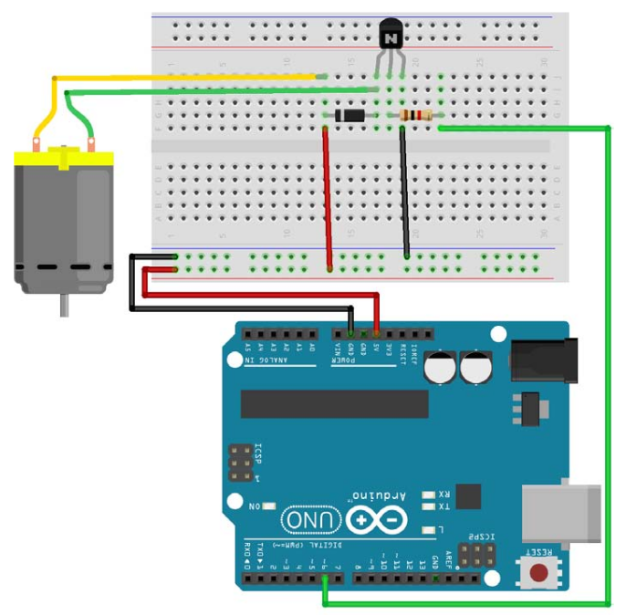
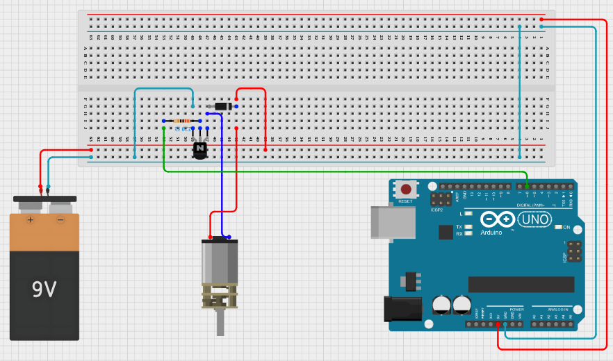
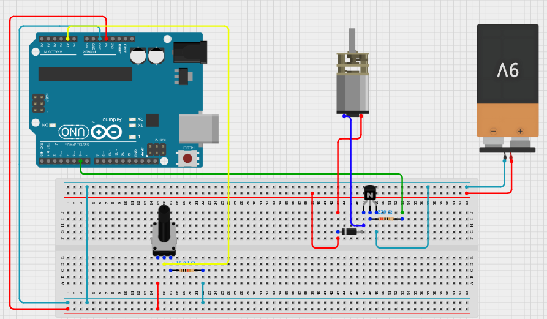

# Essay: Controlling a DC motor with arduino

- [Essay: Controlling a DC motor with arduino](#essay-controlling-a-dc-motor-with-arduino)
  - [Important notes](#important-notes)
    - [Transistor function](#transistor-function)
    - [How does analogWrite(pin, value) works?](#how-does-analogwritepin-value-works)
    - [Diode function](#diode-function)
  - [What does this circuit do](#what-does-this-circuit-do)
  - [Common components](#common-components)
  - [Practice 1: Basic controlling DC Motor](#practice-1-basic-controlling-dc-motor)
    - [1. Very Important](#1-very-important)
    - [1. Diagram](#1-diagram)
    - [Code](#code)
    - [1. Observations](#1-observations)
  - [Practice 2: Separated source](#practice-2-separated-source)
    - [2. Precautions](#2-precautions)
  - [2. Components](#2-components)
    - [2. Diagram](#2-diagram)
    - [2. Code](#2-code)
    - [2. Observations](#2-observations)
  - [Practice 3: Controlling with potentiometer](#practice-3-controlling-with-potentiometer)
    - [3. Hypothesis](#3-hypothesis)
    - [3. Components](#3-components)
    - [3. Diagram](#3-diagram)
    - [3. Code](#3-code)
    - [3. Observations](#3-observations)


To control a DC motor we need extra components for their nature. First they
usually consume more energy than a circuit to control as is arduino. Second, they
can generate an Electro-Magnetic Force that can damage our circuit.

So to solve these two problem we need to have the motor in a different source of
energy, and second a Diode just in case a Electro-Magnetic Force (EMF).

## Important notes

For previous experiences I misunderstood that one could be flexible with the
resistance value for example the sensors or LEDs, but in the case of transistors,
it seems that one need to use exactly the value that is required, so i learned
in this practice **to use exactly the same components and values to avoid problems**.
at least in my level of expertise.

### Transistor function

this is a kind of resistor but we can modify its value,
increasing or decreasing the voltage we put in the base of the transistor, and
the line of where the resistance is applied, and the line of the base input can
be from different source.
We're going to use this feature to modify the voltage that gets the motor, even
if the sources are different.

### How does analogWrite(pin, value) works?

We have a resolution of 8-bits meaning from 0 to 255, so 5v divided by 255 give us
0.02v each number, in this case we need to be aware that the motor below X voltage
won't spin, so better jump from 0v (stopped) to the-value-starts-spinning in my
case 150.

### Diode function

This component allow flow only in one way, so we can connect the diode (with the
mark pointing to positive) from ground to positive, we are not going to have a short
circuit because the diode allow ground to positive (that cannot happen), but deny
positive to ground (thats is a short circuit).
So in the case of a EMF positive can travel in oposite direction that is dangerous,
but the diode allows the flow again to positive and in the transistor (see diagram)
we have resistance and anergy between two paths it's going to travel in the path
with less resistance (as works a ground circuit) that is the diodo path, that is
what we want to protect our circuit.

## What does this circuit do

Using arduino programming we are going to control the speed of a motor, for that
we are going to vary the voltaje we send to the motor, but for the previous problems
we mentioned, we are going to apply the mentioned solutions in a progressive way,
because I'm still learning and I'm making basic errors.

## Common components

- Small DC motor 5v
- Resistance 220Ohms
- Transistor 2N2222
- Diode 1N4007 (I'm not sure)
- Arduino One

## Practice 1: Basic controlling DC Motor

In this case we only going to simulate we use two power sources, but we are going
to use only one, we are going to connect assembly the diode and transistor, to
protect our circuit.

### 1. Very Important

If you are learning use exactly the same components

### 1. Diagram



### Code

```c

int base = 6;
int speed = 0;
void setup() {
  pinMode(base,OUTPUT);
  Serial.begin(9600);
}


void loop() {
  
  for (speed=150; speed<=250; speed=speed+50){
    analogWrite(base, speed);
    printSpeed();
    delay(3000);
  }

  speed = 0;
  analogWrite(base, speed);
  delay(1000);
}

void printSpeed() {
  Serial.print("Speed: ");
  Serial.println(speed);
}

/*
print
  Speed: 150
  Speed: 200
  Speed: 250
  Speed: 0
  Speed: 150
  Speed: 200
  Speed: 250
  Speed: 0
  ...
*/

```

### 1. Observations

As we see in the print of the code we have 4 values that we send to the transistor;

- 0 stopped      = 0v
- 150 slow       = 3v (150 x 0.02)
- 200 medium     = 4v
- 250 fast equal = 5v

<!-- ■■■■■■■■■■■■■■■■ ■■■■■■■■■■■■■■■■ ■■■■■■■■■■■■■■■■ ■■■■■■■■■■■■■■■■ ■■ -->

## Practice 2: Separated source

I'm going to use a separated source for the motor, because usually is this way
how real projects works, one voltage to control, and other voltage to feed high
consumption components as in this case the DC motor.

### 2. Precautions

As i'm a novice at first I'm not going to connect the motor, I just will mesure
how the transistor change the voltaje, and then disconnect the arduino form the
computer to feed it from the wall adapter, so low the risk to damage something.
And if everything is Ok. then praying to God Cthulhu connect the motor hopping
nothing explotes.

## 2. Components

We use the same component just we add:

- Battery 9v.
- an extra wire to connect grounds.
- wall power adapter for Arduino (so not use our PC as power source)

### 2. Diagram

- Note
  - How we share grounds so the transistor get current
  - Diagram made it in [cirkitstudio](https://www.cirkitstudio.com/)



### 2. Code

```c
// to keep a top of 5v in the source of 9v our max value is 150
int unsigned speed = 0;

const unsigned base = 6;
const unsigned minToSpinMotor = 130; 
const unsigned maxToNotExceed5v = 160;
const unsigned jumpsToHave4States = 10;
const unsigned delayBetweenJumps = 3000;

void setup() {
  pinMode(base,OUTPUT);
  Serial.begin(9600);
}


void loop() {
  
  for (speed=minToSpinMotor ; speed<=maxToNotExceed5v; speed=speed+jumpsToHave4States){
    analogWrite(base, speed);
    printSpeed();
    delay(delayBetweenJumps);
  }

  speed = 0;
  analogWrite(base, speed);
  printSpeed();
  delay(delayBetweenJumps);
}

void printSpeed() {
  Serial.print("Speed: ");
  Serial.println(speed);
}
```

### 2. Observations

**For the 9v current:** We need to think in keep the max voltage of 5v to be safe
of not burn the motor, so we need to reduce the value we give to the transistor,
for example, in my case. i have a source of 9v so  9v / 255 = 0.035, that means
a value 140 in  arduino is equal a 5v the transistor will allow to pass to
the motor.

**For the transistor:** We need to share grounds in the transistor so the base
can have current, we can't use the same ground between two different sources,
apparently just with connect them directly will work as the diagram shows.

<!-- ■■■■■■■■■■■■■■■■ ■■■■■■■■■■■■■■■■ ■■■■■■■■■■■■■■■■ ■■■■■■■■■■■■■■■■ ■■ -->

## Practice 3: Controlling with potentiometer

As I already watched we control the speed of the DC motor by changing the
current I send to transistor, and this current is controlled by arduino
programming.
Now we are going to control the motor speed using a manual potentiometer, and we
need to have in consideration we need to start from a value the motor start to
spin and the top where we not exceed the 5v our motor support.

### 3. Hypothesis

As we can observe in the code of practice 2, we are moving the value of speed
variable between 130 and 160, so we need to map the lectures of the
potentiometer to this values, that in my case are from 844 to 1020.

### 3. Components

We use the same components of commons and Practice 2, just we add:

- 2k Potentiometer
- 10k resistor
- 3 extra wires

### 3. Diagram



### 3. Code

```c
int unsigned speed = 0; //from 100 to 130
int unsigned potentiometerInput = 0; //from 844 to 1022

const unsigned pinTansistorBase = 6;
const unsigned pinPotentiometer = 1;

const unsigned minToSpinMotor = 100; 
const unsigned maxToNotExceed5v = 160;
const unsigned delayBetweenJumps = 3000;

void setup() {
  pinMode(pinTansistorBase, OUTPUT);
  pinMode(pinPotentiometer, INPUT);
  Serial.begin(9600);
}


void loop() {
  potentiometerInput = analogRead(pinPotentiometer);
  speed = map(potentiometerInput, 844, 1022, minToSpinMotor, maxToNotExceed5v);
  if(speed < minToSpinMotor + 3) {
    speed = 0;
  }
  printValues();
  analogWrite(pinTansistorBase, speed);
  
  delay(250);

}

void printValues() {
  Serial.print("Potentiometer: ");
  Serial.print(potentiometerInput);
  Serial.print(", Speed: ");
  Serial.println(speed);
}

/** prints
  Potentiometer: 825, Speed: 0  <-- Min
  Potentiometer: 827, Speed: 0
  Potentiometer: 793, Speed: 0
  Potentiometer: 872, Speed: 109
  Potentiometer: 928, Speed: 128
  Potentiometer: 933, Speed: 130
  Potentiometer: 1008, Speed: 155
  Potentiometer: 1013, Speed: 156
  Potentiometer: 1022, Speed: 160  <-- Max
  Potentiometer: 1023, Speed: 160
  Potentiometer: 1017, Speed: 158
  Potentiometer: 997, Speed: 151
  Potentiometer: 980, Speed: 145
  Potentiometer: 871, Speed: 109
  Potentiometer: 862, Speed: 106
  Potentiometer: 845, Speed: 0
  Potentiometer: 845, Speed: 0
  Potentiometer: 845, Speed: 0  <-- Min
*/
```

### 3. Observations

My hypothesis was right.

**To map lectures:** we need to make use of Serial.print(), so we can observe
lectures and write down the max and min values of both scales, in this case the
scale of the transistor and the scale of the potentiometer, with this info. I
can calculate the potentiometer readings to equivalents of the transistor values.

**To stop the motor:** As we can see in the code I put a conditional to set the
speed to 0 if it's below of `minToSpinMotor + 3` so we have a margin in the
potentiometer to keep the motor off.
