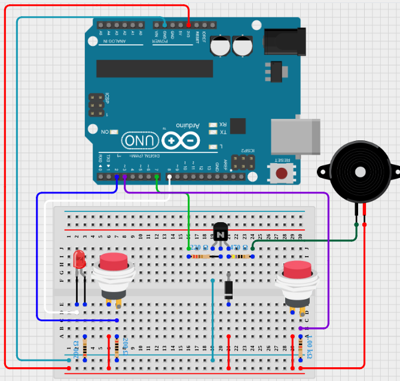

# How Do Multiple Things At The Same Time

When we want to keep a state of a component, for example, turn
on a LED for X seconds, we saw at first that we can do it using the function
`delay(X)` to keep the state and then change it, but that is a poor way to
accomplish this, Because `delay(X)` stop the `loop()` function so we can't do
any other task, for example, while we keep the LED turn on, we can't make a
lecture of a button or start a speaker.

## Practice

### Practice description

We are going to setup two buttons one turn on for 4 second a led and other turn
an speaker for 4 seconds, and it doesn't matter if the LED or the speaker is on
we need to be able to start at any point the other.

### Solution description

As in the real world we are going to use a timer, that the loop is going to keep
asking if is running or not, and according to any of two events of the timer, we
are going to change the state of a component.

In our case we are going to use 2 Timers one for the LED and another for the
Speaker.
En case case of the LED if is turn off and the timer is running we turn on the
LED, and apposite if the LED is turn on and the timer is not running we turn off
the LED.
In the case of the speaker is pretty similar.

### Components

- 1 LED Red
- 1 Transistor 2N2222
- 2 Resistor 220 (For LED and transistor)
- 1 Speaker 5v
- 1 Resistor 470 (for speaker)
- 2 Push buttons
- 2 Resistors 1k (buttons)
- 1 Diode

### Diagram



### Code

`ButtonReader`: See the practice *02_button_class_with_checking_debounccing* we
reuse this class.

`Timer`: As we explain works as a real life time, where we can set it a time, and
check if is running or not.

`BlinkingLed`: this use the timer so can turn on or off the led.

`Speaker`; The same of LED, but play he tones we defined.

`Resume`: As we said we are constantly asking to the timer if is running and
knowing its state we can decide if turn on or of the Speaker or the LED.

`Note`: We could use the `Timer` to check the debouncing in `ButtonReader` but
as it was already like that and working i decided not to refactor `ButtonReader`.

```C++
class ButtonReader {
  public:
    int unsigned status= LOW;
    bool printLogger = false;
    
  private:
    int unsigned pinbButton = 0;
    bool inValueChange = false;
    long unsigned totalMillisPassed = 0;
    long unsigned lastChangeMillis = 0;
    long unsigned millisPassedSinceLastChange = 0;
    long unsigned millisDelayToDetectChange = 50;

  public:
  
    ButtonReader(int pin) {
       this->pinbButton = pin;
    }

    void setUp() {
      pinMode(this->pinbButton, INPUT);
    }
  
  
    void readButtonStatus() {
      int reading = this->readButtonStatusChekingFalsePositive();
      if(this->buttonStateHasChanged(reading)) {
        this->status = reading;
      }
    }

    bool hasTheValueChanged() {
      if(this->inValueChange) {
        this->inValueChange = false;
        return true;
      }
      return false;
    }

    bool wasPressed() {
      if(this->hasTheValueChanged() && this->status == HIGH) {
        return true;
      }
      return false;
    }

  private:

    int readButtonStatusChekingFalsePositive() {
      if(this->isPosibleFalsePositive() == false) {
        return this->status;
      }
    
      //IMPORTANT 1
      //Somethimes keep reading HIGH, to solve this pinbButton must have a contact with ground
      int reading = digitalRead(pinbButton);
      return reading;
    }

    bool isPosibleFalsePositive() {
      bool changeDetectedInAnAcceptableTime = millisPassedSinceLastChange > millisDelayToDetectChange;
      if(changeDetectedInAnAcceptableTime == false) {
        return true;
      }
    }


    bool buttonStateHasChanged(int reading) {
      bool change = reading != this->status;
      if(change) {
        lastChangeMillis = totalMillisPassed;
        this->inValueChange = true;
      }
      return change;
    }


};


// ==================================================


class Timer {
  private:
    unsigned long timeStartingPoint = 0;
    bool thereIsStillTimeToRun = true;
    int timeToRun = 0;

  public:
    unsigned long timePassed = 0;
  
    Timer(int timeToRunArg) {
      this->timeToRun = timeToRunArg;

      timeStartingPoint = millis();
      timePassed = timeStartingPoint;
    }

    bool isItRunning() {
      this->timePassed = (this->timeStartingPoint - millis()) * -1 ;
      this->thereIsStillTimeToRun = this->timePassed <= this->timeToRun;
      return this->thereIsStillTimeToRun;
    }


    void reset() {
      timeStartingPoint = millis();
      timePassed = timeStartingPoint;
      thereIsStillTimeToRun = true;
    }

  private:

    
    
  
};


//------------------------------------------

class BlinkingLed {
  private:
    int pin = 0;
    int blinkTime = 0;
    int status = HIGH;
    Timer timer;
    bool _repeat;

  public:
    BlinkingLed(int pinParam, int blinkTimeParam, bool repeat): timer(blinkTimeParam) {
      this->pin = pinParam;
      this->blinkTime = blinkTimeParam;
      this->_repeat = repeat;
    }

    void setUp() {
      pinMode(this->pin, OUTPUT);
    }

    void start() {
      this->timer.reset();
      this->status = HIGH;
    }

    void keepLedBlinking() {
      if(this->timer.isItRunning() == false && this->_repeat == false) {
        digitalWrite(this->pin, LOW);
        return ;
      }

      
      if(this->timer.isItRunning() == false) {
        this->status = !this->status;
        this->timer.reset();
      } else {
        digitalWrite(this->pin, this->status);
      }

      
    }

    void printTime() {
      Serial.print("timePassed: ");
      Serial.print(this->timer.timePassed);
      Serial.print(", status: ");
      Serial.println(this->status);
    }
  
};


//------------------------------------------


class Speaker {
  public:
    Speaker(int pin, int soundTime, bool repeat, int tones[], int tonesSize): _timer(soundTime / tonesSize) {
      this->_pin = pin;
      this->_soundTime = soundTime;
      this->_repeat = repeat;
      this->copyTones(tones, tonesSize);
      this->_tonesSize = tonesSize;
    }

    setUp() {
      pinMode(this->_pin, OUTPUT);
    }

    void start() {
      this->_currentToneIndex = 0;
      this->_timer.reset();
    }

    void keepSounding() {
      if(this->_mustBeSilent()) {
        noTone(this->_pin);
        return;
      }

      if(this->_mustStartOver()) {
        this->_currentToneIndex = 0;
        this->_timer.reset();
      }

      if(this->_mustChangeTone()) {
        this->_currentToneIndex++;
        this->_timer.reset();
      }

      if(this->_isPlaying()) {
        tone(this->_pin, this->_tones[this->_currentToneIndex]);
        //this->_printCurrentTone();
      }
    }

    
  private:
    int _pin;
    int _soundTime;
    bool _repeat;
    int* _tones;
    int _tonesSize;

    int _currentToneIndex = 0;
    Timer _timer;
  

    void copyTones(int tones[], int size) {
      this->_tones = new int[size];
      for (int i = 0; i < size; i++) {
        this->_tones[i] = tones[i];
        Serial.print(tones[i]);
        Serial.print(", ");
      }  
    }

    
    bool _mustBeSilent() {
     return this->_currentToneIndex == this->_tonesSize && this->_repeat == false;
    }

    bool _mustStartOver() {
     return this->_currentToneIndex == this->_tonesSize;
    }

    bool _mustChangeTone() {
      return this->_timer.isItRunning() == false;
    }


    bool _isPlaying() {
      return this->_timer.isItRunning();
    }

    bool _printCurrentTone() {
      Serial.print("CurrentTone:");
      Serial.println(this->_tones[this->_currentToneIndex]);
    }

};


//=======================


BlinkingLed blinkingLed(8, 4000, false);

int tones[] = {50, 100, 150, 200};
Speaker speaker(7, 4000, false, tones, 4);
ButtonReader buttonLed(2);
ButtonReader buttonSpeaker(3);

void setup() {
  Serial.begin(9600);
  delay(1000);
  blinkingLed.setUp();
  speaker.setUp();
  buttonLed.setUp();
}

void loop() {
  blinkingLed.keepLedBlinking();
  speaker.keepSounding();
  
  buttonLed.readButtonStatus();
  if(buttonLed.wasPressed()) {
    blinkingLed.start();
    
  }


  buttonSpeaker.readButtonStatus();
  if(buttonSpeaker.wasPressed()) {
    speaker.start();
  }
  
}
```

### Observations

If we press the button near the LED this one turn on for 4 seconds. And
If we press the button near the speaker this one turn on for 4 seconds, and
not matter at what moment we press the button, it will work not matter if is
already turned on the other component. And when the arduino starts both the
starts but this only to check they are working.
